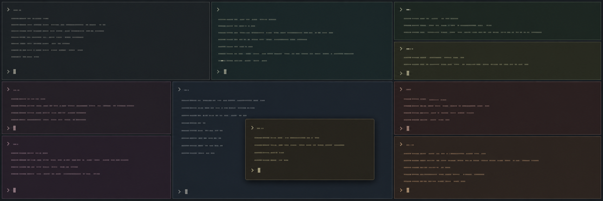

# zellij-pane-colors



[](https://github.com/sudo-vaibhav/zellij-pane-colors/actions/workflows/ci.yml)
[](LICENSE)

A tiny headless Zellij plugin that gives every terminal pane a subtly different
dark background. The palette is calm, low-saturation, and designed to make pane
boundaries apparent without turning a terminal session into a light show.

## What it does

- Colours terminal panes that exist when the plugin starts.
- Colours tiled, floating, stacked, shell, and command panes created later.
- Leaves Zellij UI plugins and its own background plugin pane untouched.
- Preserves panes that already have a `default_bg`, including layout colours.
- Assigns each pane once, so focus, resize, rename, and command updates do not
  recolour it.
- Removes closed pane IDs from its in-memory state.
- Uses no polling, daemon, shell loop, randomness, or terminal escape injection.

The plugin requests only `ReadApplicationState` and `ChangeApplicationState`.

## Compatibility

Tested with Zellij **0.44.3** and the pinned `zellij-tile` **0.44.0** SDK. The
plugin depends on the `PaneUpdate`, `PaneManifest`, `PaneId`, `default_bg`, and
`set_pane_color` APIs from the Zellij 0.44 line.

## Installation

### Download a release

```sh
install_dir="${XDG_CONFIG_HOME:-$HOME/.config}/zellij/plugins"
mkdir -p "$install_dir"
curl -fL \
  https://github.com/sudo-vaibhav/zellij-pane-colors/releases/latest/download/zellij-pane-colors.wasm \
  -o "$install_dir/zellij-pane-colors.wasm"
```

Then continue with the Zellij configuration below.

### Build it yourself

Requirements:

- Zellij 0.44.x
- Rust through [rustup](https://rustup.rs/)
- The `wasm32-wasip1` Rust target

```sh
git clone https://github.com/sudo-vaibhav/zellij-pane-colors.git
cd zellij-pane-colors
rustup target add wasm32-wasip1
./install.sh
```

This installs the plugin to:

```text
${XDG_CONFIG_HOME:-$HOME/.config}/zellij/plugins/zellij-pane-colors.wasm
```

Back up `~/.config/zellij/config.kdl`, then add the alias and startup entry. If
you already have either block, add only the indicated line inside it:

```kdl
plugins {
    pane-colors location="file:/home/YOU/.config/zellij/plugins/zellij-pane-colors.wasm"
}

load_plugins {
    pane-colors
}
```

Use the real absolute path—Zellij plugin URLs do not expand `$HOME`. Completely
quit all Zellij sessions and start Zellij again. The first launch presents a
permission prompt; approve it to enable colouring.

## Add it to an existing session

Startup configuration applies to new sessions. To colour an already-running
session immediately:

```sh
zellij action start-or-reload-plugin \
  "file:${XDG_CONFIG_HOME:-$HOME/.config}/zellij/plugins/zellij-pane-colors.wasm"
```

The plugin calls `hide_self()` and continues running in the background.

## Palette

The 16-colour curated palette lives in the clearly named
`PANE_BACKGROUND_PALETTE` constant in [`src/main.rs`](src/main.rs). Assignment
is round-robin within a session, making consecutive panes distinct and palette
wrap predictable. The foreground is never changed.

After editing the palette, run `./install.sh`, then restart Zellij or use the
existing-session command above.

## Disable, reset, and uninstall

To disable the plugin, remove or comment out `pane-colors` inside
`load_plugins`, then restart Zellij. Existing colours remain until their panes
close. Reset the current pane immediately with:

```sh
zellij action set-pane-color --reset
```

Or reset a particular pane:

```sh
zellij action set-pane-color --pane-id terminal_3 --reset
```

To uninstall, remove the `pane-colors` lines from both `plugins` and
`load_plugins`, then remove the installed artifact:

```sh
rm -f "${XDG_CONFIG_HOME:-$HOME/.config}/zellij/plugins/zellij-pane-colors.wasm"
```

## Design notes and limitation

`PaneUpdate` contains a complete pane manifest, so each update is used to find
new terminals and prune closed IDs. The handled set is updated before
`set_pane_color` runs, preventing the resulting event from creating a recolour
loop.

Zellij 0.44 exposes a pane's `default_bg` value but not its provenance. This
plugin therefore preserves every non-empty background. That reliably protects
layout-defined and resurrected colours, but also intentionally leaves alone a
pane coloured by another source.

## Contributing

Bug reports and focused pull requests are welcome. See [CONTRIBUTING.md](CONTRIBUTING.md).

## License

[MIT](LICENSE) © 2026 Vaibhav Chopra.
